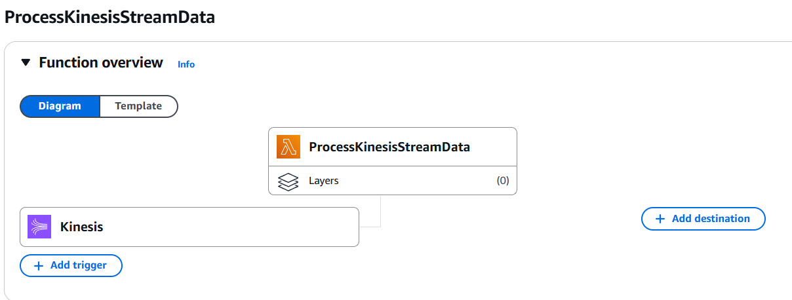
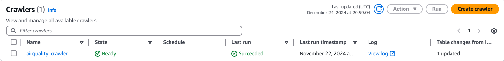
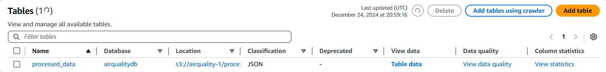
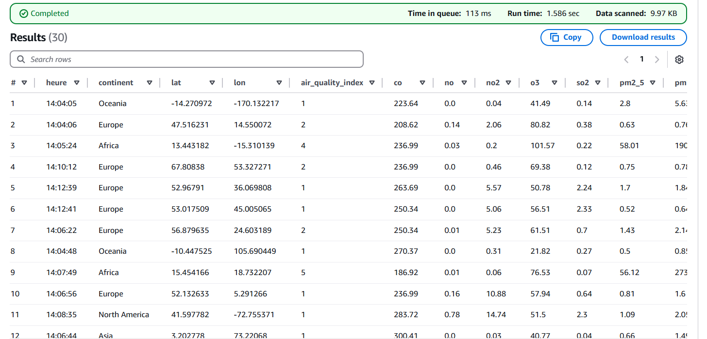
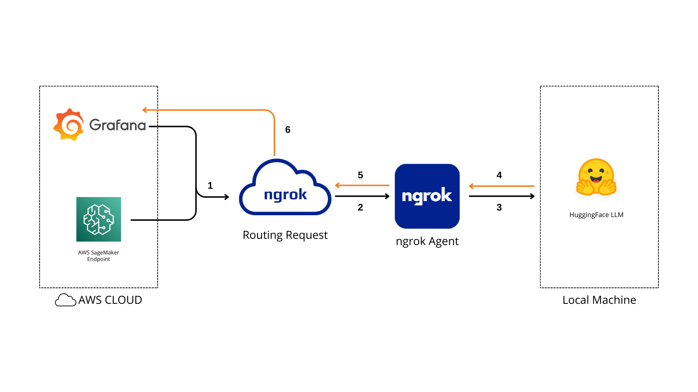
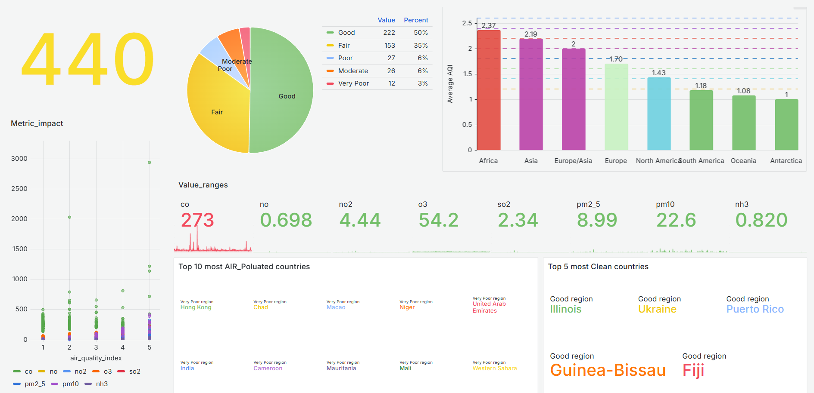
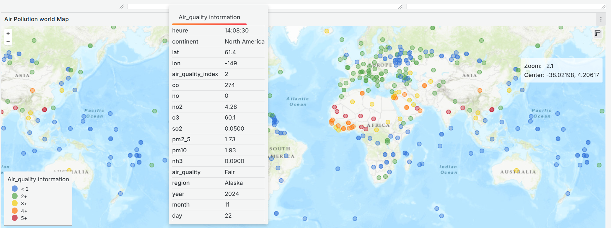

# 🌬️ AWS Real-Time Air Quality Monitoring, Prediction, and LLM-Enhanced Reporting

## 📊 Description

This cloud-driven solution leverages real-time and historical data from the OpenWeather Air Pollution API to monitor, analyze, and forecast air quality. By generating AI-powered reports, it supports timely decision-making, encourages eco-friendly practices, and fosters public awareness—contributing to healthier communities, lower pollution levels, and sustainable urban growth.

## 📑 Table of Contents

- [📌 Overview](#📌-overview)
- [🏗️ Architecture](#🏗️-architecture)
- [📁 Repository Structure](#📁-repository-structure)
- [⚙️ Prerequisites](#⚙️-prerequisites)
- [🚀 Deployment Steps](#🚀-deployment-steps)
  1. [Data Pipeline Setup](#🔧-data-pipeline-setup)
     - [Step 1: Set up EC2 Instance with cloud9 environment](#💻-step-1-set-up-ec2-instance-with-cloud9-environment)
     - [Step 2: Configure Kinesis Data Streams](#🔗-step-2-configure-kinesis-data-streams)
     - [Step 3: Lambda Function Setup](#⚡-step-3-lambda-function-setup)
     - [Step 4: Store Data in S3](#🗂️-step-4-store-data-in-s3)
     - [Step 5: Set up AWS Glue Crawlers and Tables](#🔍-step-5-set-up-aws-glue-crawlers-and-tables)
     - [Step 6: Query Data Using Athena](#📊-step-6-query-data-using-athena)
     - [Step 7: Visualize with Grafana](#📈-step-7-visualize-with-grafana)
  2. [LLM Integration](#🧠-llm-integration)
     - [Step 1: Set Grafana Variables](#⚙️-step-1-set-grafana-variables)
     - [Step 2: Load the LLM](#📥-step-2-load-the-llm)
     - [Step 3: Setup ngrok](#🌐-step-3-setup-ngrok)
  3. [Model Training ](#⚙️-model-training)
- [🎯 Results](#🎯-results)
- [🤝 Contributing](#🤝-contributing)

---

## 📈 Overview

This project harnesses AWS services, the OpenWeather API, and machine learning tools to collect, process, and visualize real-time air quality data. The solution automates data retrieval, ensures efficient cloud storage, and processes the data for insightful analytics, enabling real-time visualization and accurate predictive analysis.

---

### 🚀 **Key Features**

#### 📡 **1. Real-Time Data Ingestion**

Leverage EC2 instances to fetch real-time weather data continuously from the OpenWeather API, ensuring up-to-date and reliable information.

#### 🔄 **2. Scalable Data Streaming & Processing**

Stream data seamlessly through Amazon Kinesis Data Streams for efficient real-time handling. AWS Lambda functions process the data, converting it into a structured format before storing it securely in Amazon S3.

#### 🔧 **3. Smart Data Transformation & Cataloging**

Automatically discover and catalog processed data with AWS Glue Crawlers. Utilize Amazon Athena for running SQL queries, enabling effortless reporting and data analysis.

#### 📊 **4. Insightful Visualization with Grafana**

Integrate Grafana to craft interactive dashboards that showcase key metrics such as temperature, humidity, and weather trends, offering real-time insights and monitoring.

#### 🤖 **5. Advanced Machine Learning Predictions**

Use AWS SageMaker to develop, train, and deploy machine learning models. These models predict weather patterns, such as temperature forecasts or specific conditions, accessible via an API Gateway for on-demand inference.

#### 🧠 **6. Enhanced Insights with LLM Integration**

Incorporate Large Language Models (LLMs) to generate intuitive reports and derive deeper insights from weather data, enhancing decision-making through easy-to-understand narratives.

#### 🔁 **7. Fully Automated Data Management**

Automate the entire pipeline for continuous updates, robust error handling, and seamless scalability, ensuring efficient processing of high-volume weather data.

---

## 🏗️ Architecture

The following AWS services are used in the architecture:

1. **OpenWeather (API)**: Fetches real-time weather data.
2. **EC2**: Hosts a service that fetches data from OpenWeather API.
3. **Kinesis Data Stream**: Streams the weather data for further processing.
4. **Lambda**: Transforms the data and processes it.
5. **S3**: Stores the processed data in a structured format.
6. **Glue Crawlers**: Catalogs the data in S3 for querying.
7. **Athena**: Queries the data stored in S3.
8. **API Gateway**: Exposes the service to other applications or external consumers.
9. **Grafana**: Visualizes data using custom dashboards.
10. **SageMaker**: Deploys machine learning models.
11. **LLM Integration:** Large Language Models (LLMs) are integrated for report generation and deeper insights into predicted values.
12. **ngrok**: Exposes the local API Gateway for external testing.

<picture>
  <source media="(prefers-color-scheme: dark)" srcset="Images/Architecture-dark.png">
  <source media="(prefers-color-scheme: light)" srcset="Images/Architecture-light.png">
  
</picture>

---

## 📁 Repository Structure:

```bash
  .
  ├── Data_ingestion
  │   └── data_ingestion.py
  │─ Grafana
  │   └── data_schema.json
  │─ Training
  │   └── airqualityprediction.ipynb
  ├── Images
  ├── Lambda_function
  │   └── data_transformation.py
  ├── LLM_reporting
  │   └── report_generation.py
  └── datasets
      ├── countries.csv
      └── data_schema.json
```

---

## ⚙️ Prerequisites

To successfully set up and deploy this project, you will need the following:

### 1. **AWS Account**

- An active AWS account with permissions to use services like EC2, S3, Lambda, Kinesis, Glue, Athena, SageMaker, and API Gateway.

### 2. **OpenWeather API Key**

- Sign up at [OpenWeather](https://openweathermap.org/api) to get an API key for the Air Pollution API.

### 3. **AWS IAM Roles and Policies**

- Create or configure IAM roles with permissions for the following services:
- Amazon EC2
- Amazon Kinesis
- Amazon S3
- AWS Lambda
- AWS Glue
- Amazon Athena
- Amazon SageMaker
- Attach policies like `AmazonS3FullAccess`, `AmazonKinesisFullAccess`, and `AWSLambdaBasicExecutionRole`.

### 4. **Python Environment**

- Ensure Python 3.x is installed along with required libraries on your AWS EC2 and Lambda environment:
  ```bash
  pip install boto3 requests json time
  ```

### 6. **Grafana Setup**

- Download Grafana for your environment or plan to set it up on an EC2 instance.
- Guide: [Grafana Installation](https://grafana.com/docs/grafana/latest/setup-grafana/installation/).

### 7. **ngrok**

- Install `ngrok` to expose local APIs for testing.
- Download: [ngrok](https://ngrok.com/download).

### 8. **Access Credentials**

- AWS access key ID and secret access key for programmatic access.
- Ensure the credentials are stored securely using environment variables or AWS credentials files.

### 9. **System Requirements**

- **Operating System**: Linux, macOS, or Windows
- **RAM**: 16 GB or higher recommended
- **Storage**: At least 50 GB of free space (depending on model size)
- **Python**: 3.8 or higher

### 10. **GPU Requirements**

- **NVIDIA GPU**: Ensure you have an NVIDIA GPU with CUDA support for accelerated model training and inference.
- **CUDA and cuDNN**:
  - Install [CUDA Toolkit](https://developer.nvidia.com/cuda-toolkit) (minimum version 11.x recommended).
  - Install [cuDNN](https://developer.nvidia.com/cudnn).
  - Verify installation by running:
    ```bash
    nvidia-smi
    ```
    This will display GPU and CUDA driver details.
- **TensorFlow GPU**:

  ```bash
  pip install tensorflow-gpu
  ```

- **PyTorch with GPU Support** (Optional if using PyTorch):
  ```bash
  pip install torch torchvision torchaudio --index-url https://download.pytorch.org/whl/cu118
  ```
  Alternatively, follow the official installation guide [here](https://pytorch.org/get-started/locally/).

### 11. **Python Environment Setup**

- **Create Virtual Environment**:
  ```bash
  python3 -m venv venv
  source venv/bin/activate  # Linux
  ```

### 12. **Model and Hugging Face Setup**

- Install Hugging Face `transformers` and `datasets` libraries:
  ```bash
  pip install transformers datasets
  ```
- **Hugging Face Authentication**:
  ```bash
  huggingface-cli login
  ```
- Ensure you have access to the `meta-llama/Llama-3.2-3B-Instruct` model through Hugging Face.

---

## 🚀 Deployment Steps

---

### 🔧 Data Pipeline Setup

#### 💻 Step 1: Set up EC2 Instance with cloud9 environment

1.  Go to the Cloud9 dashboard in the AWS Management Console.
2.  Launch a new Cloud9 environment with a new EC2 Instance.
    - Choose the instance type `t2.micro` with Amazon Linux.
    - Select the Secure Shell (SSH) connection type.
3.  Open the Cloud9 IDE and install the necessary packages:
    ```bash
    sudo apt update
    sudo apt install python3-pip
    pip3 install boto3 requests csv time json io
    ```
4.  Create a Python script (`fetch_data.py`) to fetch data from the OpenWeather API.
    It is important to configure the Kinesis client before fetching the data and set up the AWS Credentials:

    ````python
    aws_region = "your-region-here"
    aws_access_key_id="aws-access-id"
    aws_secret_access_key="your-secret-access-keye-here"

        KINESIS_STREAM_NAME = "airpollution_data"

        kinesis_client = boto3.client('kinesis',
            region_name=aws_region,
            aws_access_key_id=aws_access_key_id,
            aws_secret_access_key=aws_secret_access_key,
            aws_session_token=aws_session_token)
        ```
    ````

##### Note:

- It is necessary to have an S3 bucket named `useful-data-bucket` that containes the csv file `countries.csv`.

---

#### 🔗 Step 2: Configure Kinesis Data Streams

1. Navigate to the **Kinesis** section in AWS Console and Click on **Create stream**.
2. Name your stream (e.g., `airpollution_data`), and define the number of shards based on your data volume or choose the `On-Demand` option.
3. Once the stream is created, ensure the EC2 instance has the proper IAM role to send data to Kinesis.

---

#### ⚡ Step 3: Lambda Function Setup

1. Go to **AWS Lambda** and create a new function.
2. Select **Author from scratch** and use an the python runtime.
3. Set permissions for Lambda to read from Kinesis and write to S3.
4. Install the necessary packages:
   ```bash
   pip install boto base64 json datetime
   ```
5. Use the Lambda function (`data_transformation.py`) to format data and write it into the S3 bucket.

<picture>
  <source media="(prefers-color-scheme: dark)" srcset="Images/lambda-dark.png">
  <source media="(prefers-color-scheme: light)" srcset="Images/lambda-light.png">
  
</picture>

---

#### 🗂️ Step 4: Store Data in S3

1. Create an S3 bucket:
   - Go to **S3** in AWS Console and click **Create Bucket** and specify a unique name (e.g. `airquality-databucket`).
   - Set permissions and configure the bucket to store the processed weather data.
   - The data is stored in folders, each folder designating a specific country and its corresponding data.
2. Ensure that the Lambda function has the appropriate IAM role to write data to S3.

---

#### Step 5: Set up AWS Glue Crawlers and Tables

1. Go to AWS Glue Databases and create a new Database with a unique name (e.g., `airquality_base`).
2. Go to AWS Glue and create a new Crawler.
3. Define the source as the S3 bucket where weather data is stored.
4. Set the `airquality_base` database as the output.
5. Set up the crawler to run on a scheduled basis (e.g., every hour) to keep the Glue Catalog up-to-date.
6. After running the whole pipeline, navigate to the AWS Glue Table schema and make sure it is identical to `data_schema.json` or update it.

##### Crawler Running Successfully

<picture>
  <source media="(prefers-color-scheme: dark)" srcset="Images/crawler-dark.png">
  <source media="(prefers-color-scheme: light)" srcset="Images/crawler-light.png">
  
</picture>

##### AWS Glue Table Catalog Created

<picture>
  <source media="(prefers-color-scheme: dark)" srcset="Images/catalogue-dark.png">
  <source media="(prefers-color-scheme: light)" srcset="Images/catalogue-light.png">
  
</picture>

---

#### 📊 Step 6: Query Data Using Athena

1. Access the **Athena** console and create a new database to store query results.
2. Define a table that references the Glue-cataloged data stored in S3.
3. Execute SQL queries to analyze the air quality data.  
   Example query:

   ```sql
   SELECT * FROM "airquality_base"."airquality_databucket" LIMIT 30;
   ```

   The query result visualization should appear as follows:

   <picture>
     <source media="(prefers-color-scheme: dark)" srcset="Images/athena-dark.png">
     <source media="(prefers-color-scheme: light)" srcset="Images/athena-light.png">
     
   </picture>

---

#### 📈 Step 7: Visualize with Grafana

##### Install Grafana

To visualize the air pollution data, we installed Grafana on an `t2.medium` EC2 instance

##### Grafana Installation

1. Download and run Grafana:
   - Create an t2.medium EC2 Instance and update the inbound rules on port 3000
   - Open the Instance terminal and install Grafana
     ```bash
     sudo yum update -y
     sudo yum install grafana -y
     sudo systemctl daemon-reload
     ```
2. Create the file `credentials`in the folder path `usr/share/grafana/.aws` and store your AWS credentials inside. - These tokens are available in your AWS console under:
   AWS Management Console → AWS Details section when you sign in to your AWS interface.
3. Launch and enable Grafana:
   ```bash
   sudo systemctl start grafana-server
   sudo systemctl enable grafana-server.service
   ```
4. Once Grafana is running, access it at `http://<instance-address>:3000`. The default credentials are:
   - Username: `admin`
   - Password: `admin`
5. After logging in, change the password for security purposes.

##### Add Athena as a Data Source

1. In Grafana, go to **Configuration** > **Data Sources** > **Add Data Source**.
2. Select **Athena** from the list of available data sources.
3. Enter the connection details:
   - **Name**: A name for the data source (e.g., `Athena Air Pollution Data`).
   - Use the `Credentials file` as the Authentication provider and select the region where your Athena queries will run.
   - **Athena Workgroup**: Specify the workgroup you are using (or leave default).
   - Select the **Database** and the **Table** you are qureing as well as the S bucket for query results' storage.

##### Create a Dashboard in Grafana

1. After configuring the Athena data source, create a new dashboard in Grafana.
2. Add panels for visualizing weather data.
3. Configure queries for each panel.

   If you want to implement my dashboard directly, take the data_schema.json file from the Grafana folder in my repository and add it to your settings for quick deployment. 📂⚙️

---

### ⚙️ Model Training

To predict air quality indices (AQI) based on weather data, we have developed a deep learning model using TensorFlow/Keras. The approach focuses on capturing relationships between weather factors (e.g., temperature, humidity, wind speed) and air pollution metrics (e.g., NO2, PM2.5, SO2) to estimate AQI levels.

#### 🚀 Approach

1. **Model Architecture**

   - Designed to capture complex relationships between weather conditions and air quality metrics.
   - Utilizes layers such as dense, convolutional, and recurrent networks based on the data characteristics.

2. **Training Strategy**
   - **EarlyStopping**: Helps prevent overfitting by halting training once validation performance stagnates.
   - **ModelCheckpoint**: Saves the best-performing model during training, ensuring the optimal model is retained.
   - **ReduceLROnPlateau**: Dynamically adjusts the learning rate to help the model converge more effectively.

#### 🔧 Model Configuration

- **Training Parameters**:

  - Epochs: 100
  - Batch Size: 16
  - Validation Split: `X_val`, `y_val`

- **Callbacks**:
  - **EarlyStopping**: Monitors `val_accuracy` and stops training when performance stops improving (patience=20, min_delta=0.0001).
  - **ModelCheckpoint**: Saves the best model `best.keras` based on `val_accuracy`.
  - **ReduceLROnPlateau**: Adjusts the learning rate to `0.000001` when performance stagnates (factor=0.4, patience=5).

This training strategy ensures robust model learning and optimal performance for AQI prediction from weather data.

---

### 🧠 LLM Integration

This section demonstrates how to integrate a Large Language Model (LLM) into the project for enhanced report generation and insights.

<picture>
  <source media="(prefers-color-scheme: dark)" srcset="Images/llm-dark.png">
  <source media="(prefers-color-scheme: light)" srcset="Images/llm-light.png">
  
</picture>

#### ⚙️ Step 1: Set Grafana Variables

1. Open your Grafana Dashboard.
2. Navigate to **Settings** > **Variables**.
3. - Create a custom variable for each predicted Value as well as the month to generate the report on.
   - Set the data source as the source of the model prediction
4. Test the variables by applying them to a sample panel.

#### 📥 Step 2: Load the LLM

1. **Prepare the LLM Environment**:
   - Install the required Python libraries such as `transformers`, `flask` and `logging` (optional):
     ```bash
     pip install transformers flask logging
     ```
2. **Create a Script for LLM Integration**:

   - Write a Python script to query the LLM for analyzing the predicted values of pollutants and AQI: `llm.py`

3. **Integrate LLM Output into Grafana**:
   - Use Grafana's **Table Pannel** to display LLM-generated report.

#### 🌐 Step 3: Setup ngrok

1. **Install ngrok**:

   - Download and install ngrok from [ngrok.com](https://ngrok.com/).
   - Authenticate using your ngrok account:
     ```bash
     ngrok authtoken <YOUR_AUTH_TOKEN>
     ```

2. **Expose Local Services**:

   - Use ngrok to expose your local API Gateway or LLM services:
     ```bash
     ngrok http 5000
     ```

3. **Update API Endpoints**:
   - Copy the generated ngrok URL and use it in your Grafana data source to access the LLM service remotely.
   - Example:
     ```bash
     Forwarding    https://<unique-id>.ngrok.io -> localhost:5000
     ```

---

## 🎯 Results

### Data Visualization Dashboard

| Metric                                        | Description                                                                                   | Visualization |
| --------------------------------------------- | --------------------------------------------------------------------------------------------- | ------------- |
| **1. Total Data Count**                       | Displays the total number of air quality data points.                                         | Total Number  |
| **2. Air Quality Unique Count**               | Pie chart displaying categories: Fair, Good, Poor, Very Poor, Moderate.                       | Pie chart     |
| **3. Average Air Quality Index by Continent** | Bar chart showing average AQI by continent.                                                   | Bar chart     |
| **4. Metric Impact**                          | Scatter plot showing the impact of pollutants on AQI values.                                  | Scatter plot  |
| **5. Top 10 Most Polluted Countries**         | List of top regions with very poor air quality.                                               |               |
| **6. Top 5 Cleanest Countries**               | List of top regions with good air quality.                                                    |               |
| **7. Value Ranges**                           | Display of pollutant levels categorized into ranges.                                          | Range values  |
| **8. Air Pollution World Map**                | Global map with color-coded air quality labels: Good, Fair, Poor, Very Poor.                  | Global map    |
| **9. Detailed Data Tooltip**                  | Information displayed on hover (timestamp, region, continent, AQI quality, pollutant levels). | Tooltip       |

**Purpose**: This dashboard provides a comprehensive overview of global air quality, offering insights into pollution levels, geographic distribution, and identifying clean and polluted regions.

<picture>
  <source media="(prefers-color-scheme: dark)" srcset="Images/vis1-dark.png">
  <source media="(prefers-color-scheme: light)" srcset="Images/vis1-light.png">
  
</picture>
<picture>
  <source media="(prefers-color-scheme: dark)" srcset="Images/vis2-dark.png">
  <source media="(prefers-color-scheme: light)" srcset="Images/vis2-light.png">
  
</picture>

### Air Quality Forecast and LLM-Generated Report Dashboard

| Metric                                      | Description                                                                                                                                                                                                   |
| ------------------------------------------- | ------------------------------------------------------------------------------------------------------------------------------------------------------------------------------------------------------------- |
| **Country Selection**                       | Dropdown to select a country for air quality predictions.                                                                                                                                                     |
| **Metric Predictions for Selected Country** | Line graph showing predictions for AQI and specific pollutants for the coming year.                                                                                                                           |
| **Mean Values**                             | Displays mean pollutant levels (Global_AQI, NO2, O3, PM10, PM2.5, SO2).                                                                                                                                       |
| **Report Description**                      | Overview of air quality for the selected country. Highlights AQI levels compared to WHO recommendations, describes pollutants and their health implications, and identifies key pollution sources and trends. |

**Purpose**: This dashboard includes predictive analysis and detailed reports for specific countries.

<picture>
  <source media="(prefers-color-scheme: dark)" srcset="Images/pred-dark.png">
  <source media="(prefers-color-scheme: light)" srcset="Images/pred-light.png">
  
</picture>

## 🤝 Contributing

If you have suggestions for improving the pipeline or visualizations, feel free to fork the repository and submit pull requests.

### Contributing Guidelines:

1. **Fork** the repository and clone it locally.
2. Make your changes and ensure that new code adheres to the project's code standards.
3. **Test** your changes.
4. Create a **pull request** with a detailed description of your changes.
